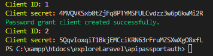

# Laravel 10 Paasport API Authentication
* Install passport ```composer require laravel/passport```
* Troubling issue to fix intalling passport ```issue line```
```
./composer.json has been updated
> php artisan clear-compiled
Loading composer repositories with package information
Updating dependencies (including require-dev)
Your requirements could not be resolved to an installable set of packages.
```
### Passport Configuration 
* Migrate ```php artisan migrate```
* Passport install ```php artisan passport:install```


* Insure those line on user model
```
use HasApiTokens, HasFactory, Notifiable;
```
* Go to ```config.php``` and below code
```
  'guards' => [
        'web' => [
            'driver' => 'session',
            'provider' => 'users',
        ],

        'api' => [
            'driver' => 'passport',
            'provider' => 'users',
        ],
    ],
```
* Configure route, and UserController and UserModel
* Set Migration and seeder
```

        \App\Models\User::factory()->create([
            'name' => 'Test User',
            'email' => 'test@example.com',
            'usertype'=>'admin',
            'password'=>bcrypt(123456)
        ]);
```
* Replace Sanctum by ```use Laravel\Passport\HasApiTokens``` on user model

